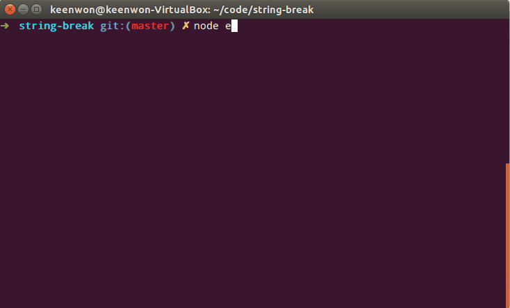

# String-Break

[![NPM version][npm-image]][npm-url]
[![Build Status][travis-image]][travis-url]
[![Build status][appveyor-image]][appveyor-url]
[![npm download][download-image]][download-url]



String-Break 是命令行字符串格式化工具，可以方便的将长字符串按照宽度分段。
  
特点:

  - 支持中文，英文，中英文混排
  - 英文不会被截断
  - 标点不会出现在行首

## Install

```shell
npm install string-break --save
```

## Usage

```js
const stringBreak = require('string-break');
const str = '远处海港传来阵阵船笛 我一直飘零到被你拣起 如今望著反映窗户玻璃 有个我陌生又熟悉';

let lines = stringBreak(str, 30);
/**
 * lines: [ 
 *   '远处海港传来阵阵船笛 我一直飘',
 *   '零到被你拣起 如今望著反映窗户',
 *   '玻璃 有个我陌生又熟悉'
 * ]
 */
```

## License

MIT.

[npm-image]: https://img.shields.io/npm/v/string-break.svg?style=flat-square
[npm-url]: https://www.npmjs.com/package/string-break
[travis-image]: https://img.shields.io/travis/keenwon/string-break.svg?style=flat-square
[travis-url]: https://travis-ci.org/keenwon/string-break
[appveyor-image]: https://ci.appveyor.com/api/projects/status/p9cm8q4y9ail1kks/branch/master?svg=true
[appveyor-url]: https://ci.appveyor.com/project/keenwon/string-break
[download-image]: https://img.shields.io/npm/dm/string-break.svg?style=flat-square
[download-url]: https://npmjs.org/package/string-break